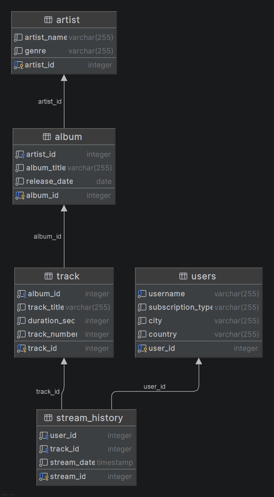

# Practical Assignment 1 — Semenchenko Ivan
## Опис бази даних
Ця база даних є спрощеною моделлю сервісу Apple Music

У якій є п'ять таблиць

| Таблиця | Опис                                                                             |
|---|----------------------------------------------------------------------------------|
| `artist` | Інформація про виконавців та їхні музичні жанри                                  |
| `album` | Музичні альбоми, прив'язані до конкретних артистів                               |
| `track` | Пісні з тривалістю та порядковим номером в альбомі                               |
| `users` | Профілі користувачів платформи, тип підписки (Free/Premium) та їхнє розташування |
| `stream_history` | Історія прослуховувань де видно хто, що, де, коли послухав                       |

Схема таблиці:

## Функціонал та результати запиту

Мій запит аналізує історію стрімінгу за такими принципами:

Фільтрація за підпискою: Виводить виключно тих користувачів, які мають платну підписку `Premium`

Часовий діапазон: Враховує лише ті прослуховування, що відбулися в період між `2026-06-09` та `2026-06-10`

Агрегація альбомів: Об'єднує (`GROUP BY`) окремі прослуховування різних пісень, якщо вони належать до одного й того самого альбому

Агрегація кількості прослуховувань: Рахує загальну кількість прослуховувань треків з цього альбому

Метрика часу: Розраховує загальний час прослуховування в секундах (`listening_time`), який користувачі сумарно витратили на цей альбом

Сортування: Усі результати автоматично сортуються за часом прослуховування від найбільшого до найменшого (`ORDER BY listening_time DESC`)

І виводить в форматі 

| username | country | city | artist_name| album_title | subscription_type | streams_count | listening_time |
|---|---|---|---| ---|---|---|---|

## Пояснення запиту

Спочатку я написав CTE, котра об'єднує всі 5 таблиць за їхніми спільними ключами

Потім обирає рядки там де дата між `2026-06-09` та `2026-06-10`

Групує рядки за полями username, country, city, artist_name, album_title, subscription_type

Для кожної групи обчислюються: кількість прослуховувань (streams_count), загальний час прослуховування в секундах (listening_time)

Робимо перший запит до CTE та обираємо рядки там де країна 'Ukraine' та тип підписки 'Premium'

Робимо другий запит до CTE та обираємо рядки там де країна 'Poland' та тип підписки 'Premium'

Потім об'єднуємо їх вертикально за допомогою Union All

Та сортуємо за спаданням по стовпцю listening_time 

## Додатково

Запит Create_tables.sql для створення таблиць як у мене

Запит Insert_data.sql для вставки таких самих даних як у мене

Планував базу даних в [drawDB](https://www.drawdb.app/) та [ER Flow](https://app.erflow.io)
