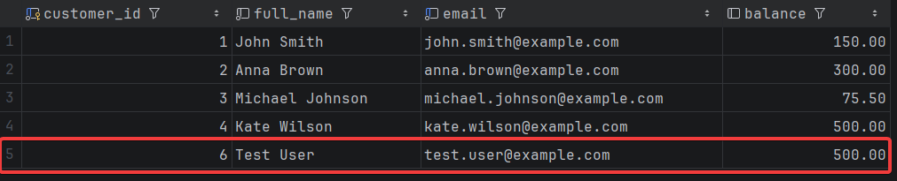
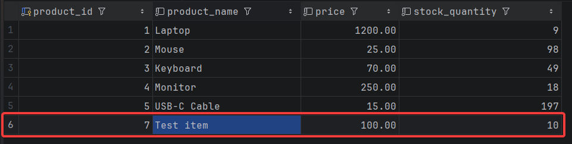
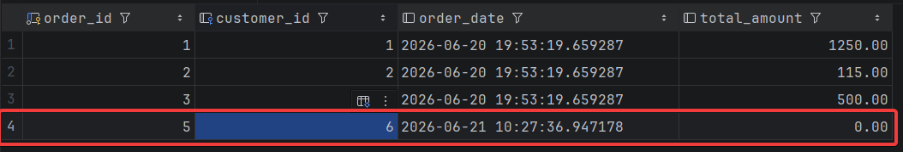
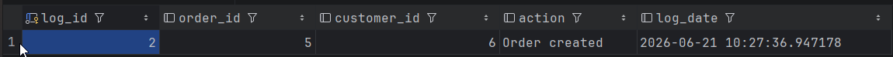
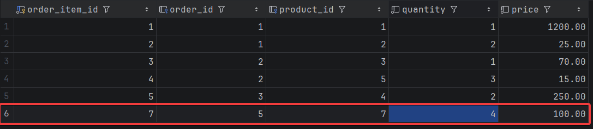
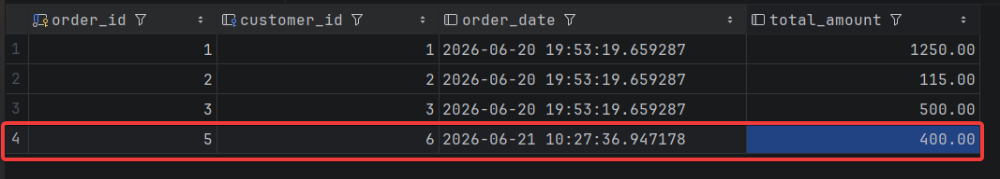
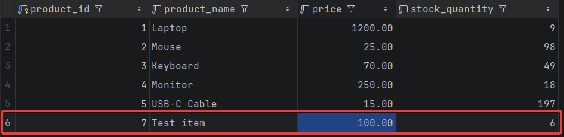

# Practical Assignment 3 — Semenchenko Ivan

## Опис бази даних

Ця база даних — спрощена модель системи управління замовленнями інтернет-магазину.

У якій є п'ять таблиць:

| Таблиця | Опис |
|---|---|
| `customers` | Профілі клієнтів з іменем, email та балансом |
| `products` | Каталог продуктів з назвою, ціною та кількістю на складі |
| `orders` | Замовлення клієнтів з датою та загальною сумою |
| `order_items` | Окремі позиції замовлення з кількістю та ціною |
| `order_log` | Журнал подій — логує створення нових замовлень |

## Функціонал

### Task 1 — Функція: підрахунок суми замовлення

Функція `calculate_order_total(p_order_id int)` повертає загальну суму замовлення, рахуючи `quantity * price` по всіх позиціях з `order_items`. Якщо замовлення не має жодної позиції — повертає `0` через `COALESCE`.

```sql
CREATE OR REPLACE FUNCTION calculate_order_total(p_order_id int)
RETURNS numeric
LANGUAGE plpgsql
AS $$
BEGIN
    RETURN (
        SELECT COALESCE(SUM(quantity * price), 0)
        FROM order_items
        WHERE order_id = p_order_id
    );
END;
$$;
```

### Task 2 — Процедура: створення замовлення

Процедура `create_order(p_customer_id int)` створює нове замовлення для клієнта. Перед вставкою перевіряє чи існує клієнт з таким `customer_id` — якщо ні, кидає виключення. Нове замовлення отримує поточний час і `total_amount = 0`.

```sql
CREATE OR REPLACE PROCEDURE create_order(p_customer_id int)
LANGUAGE plpgsql
AS $$
BEGIN
    IF NOT EXISTS (SELECT * FROM customers WHERE customer_id = p_customer_id)
        THEN
            RAISE EXCEPTION 'Id error';
        END IF;
    INSERT INTO orders(customer_id, order_date, total_amount)
    VALUES (p_customer_id, now(), 0);
END;
$$;
```

### Task 3 — Процедура: додавання продукту до замовлення

Процедура `add_product_to_order(p_order_id int, p_product_id int, p_quantity int)` додає позицію до замовлення. Бере актуальну ціну з таблиці `products`, зменшує `stock_quantity` і вставляє рядок в `order_items`. Має два захисти: не дозволяє додати більше товару ніж є на складі, і не дозволяє передати нульову або від'ємну кількість.

```sql
CREATE OR REPLACE PROCEDURE add_product_to_order(
    p_order_id int,
    p_product_id int,
    p_quantity int
)
LANGUAGE plpgsql
AS $$
BEGIN
    IF p_quantity > (SELECT stock_quantity FROM products WHERE product_id = p_product_id)
        THEN
            RAISE EXCEPTION 'Недостатньо товару на складі';
        END IF;
    IF p_quantity <= 0
        THEN
            RAISE EXCEPTION 'Кількість має бути більшою за нуль';
        END IF;
    INSERT INTO order_items(order_id, product_id, price, quantity)
    VALUES (p_order_id, p_product_id, (SELECT price FROM products WHERE product_id = p_product_id), p_quantity);
    UPDATE products
    SET stock_quantity = stock_quantity - p_quantity
    WHERE product_id = p_product_id;
END;
$$;
```

### Task 4 — Тригер: автоматичне оновлення суми замовлення

Тригерна функція `update_order_total()` викликає `calculate_order_total()` і оновлює `total_amount` в таблиці `orders`. Тригер спрацьовує після будь-якої зміни в `order_items` — `INSERT`, `UPDATE` або `DELETE`. При `DELETE` бере `order_id` зі старого рядка (`OLD`), в інших випадках — з нового (`NEW`).

```sql
CREATE OR REPLACE FUNCTION update_order_total()
RETURNS trigger
LANGUAGE plpgsql
AS $$
DECLARE
    v_order_id int;
BEGIN
    IF TG_OP = 'DELETE'
        THEN
            v_order_id := OLD.order_id;
        ELSE
            v_order_id := NEW.order_id;
        END IF;
    UPDATE orders
    SET total_amount = calculate_order_total(v_order_id)
    WHERE order_id = v_order_id;
    RETURN NULL;
END;
$$;

CREATE OR REPLACE TRIGGER update_total_amount
AFTER INSERT OR UPDATE OR DELETE
ON order_items
FOR EACH ROW
    EXECUTE FUNCTION update_order_total();
```

### Task 5 — Тригер: логування створення замовлення

Тригерна функція `log_new_order_func()` після кожного нового замовлення в `orders` вставляє запис в `order_log` з `order_id`, `customer_id`, типом дії та поточним часом.

```sql
CREATE OR REPLACE FUNCTION log_new_order_func()
RETURNS trigger
LANGUAGE plpgsql
AS $$
BEGIN
    INSERT INTO order_log(order_id, customer_id, action, log_date)
    VALUES (new.order_id, new.customer_id, 'Order created', now());
    RETURN NEW;
END;
$$;

CREATE OR REPLACE TRIGGER update_order_log
AFTER INSERT
ON orders
FOR EACH ROW
    EXECUTE FUNCTION log_new_order_func();
```

### Task 6 — Тестування

Тестовий скрипт демонструє повний цикл роботи системи: створення клієнта і продукту, виклик процедур, автоматичне оновлення суми і логування.

```sql
-- Show customers can be created, products can be created
INSERT INTO customers (full_name, email, balance)
VALUES ('Test User', 'test.user@example.com', 500.00);

INSERT INTO products (product_name, price, stock_quantity)
VALUES ('Test item', 100.00, 10);

-- Show orders can be created using the procedure
CALL create_order(6);

-- Show products can be added to orders using the procedure
CALL add_product_to_order(5,7,4)
```

### Результати

**Клієнт створений** — `customer_id = 6`, `Test User` з балансом 500.00:



**Продукт створений** — `product_id = 7`, `Test item` з ціною 100.00 і 10 одиницями на складі:



**Замовлення створене через процедуру** — `order_id = 5`, `customer_id = 6`, `total_amount = 0.00`:



**Тригер залогував створення замовлення** — в `order_log` з'явився запис з `order_id = 5`, `customer_id = 6`, дія `Order created`:



**Продукт доданий до замовлення через процедуру** — в `order_items` з'явився рядок з `order_id = 5`, `product_id = 7`, кількість 4, ціна 100.00:



**Тригер оновив суму замовлення** — `total_amount` автоматично змінився з 0.00 на 400.00:



**Кількість товару на складі зменшилась** — `stock_quantity` продукту `Test item` змінився з 10 до 6:



_PS: id скрізь йде з пропуском — бо перед фінальним тестом я видалив дані пробного запуску_

## Додатково

`main_query.sql` — повний скрипт з усіма функціями, процедурами, тригерами та тестами

`answers.md` — відповіді на теоретичні питання (Bonus Task 2)

`query_analysis.md` — аналіз плану виконання запиту (Bonus Task 3)