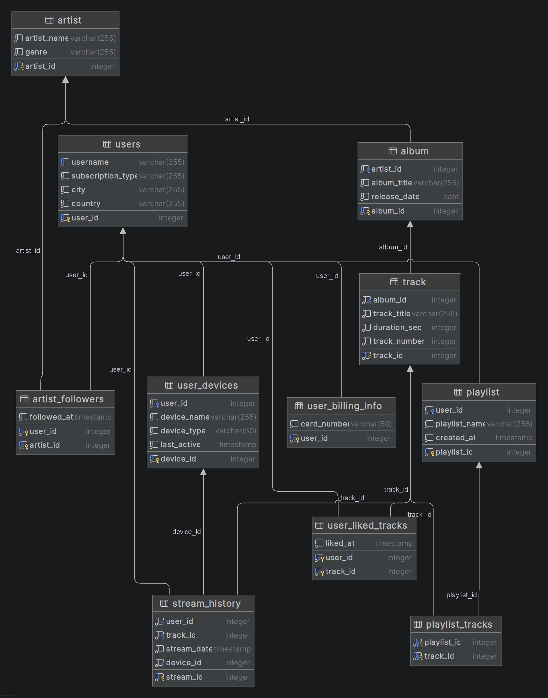
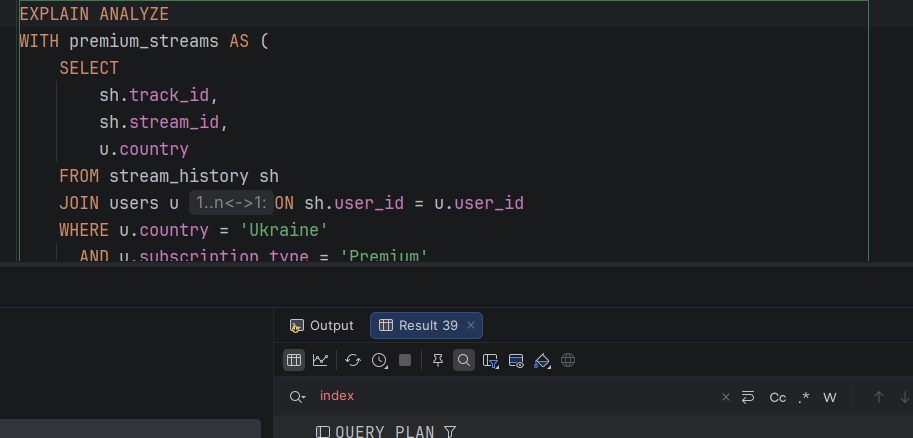
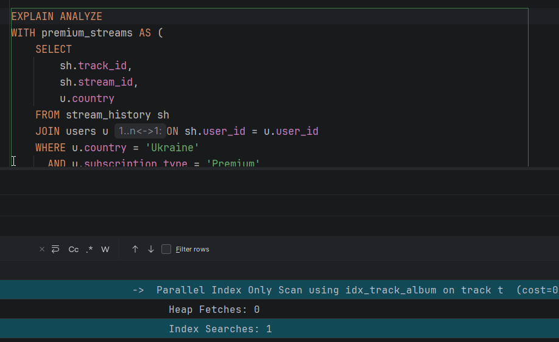
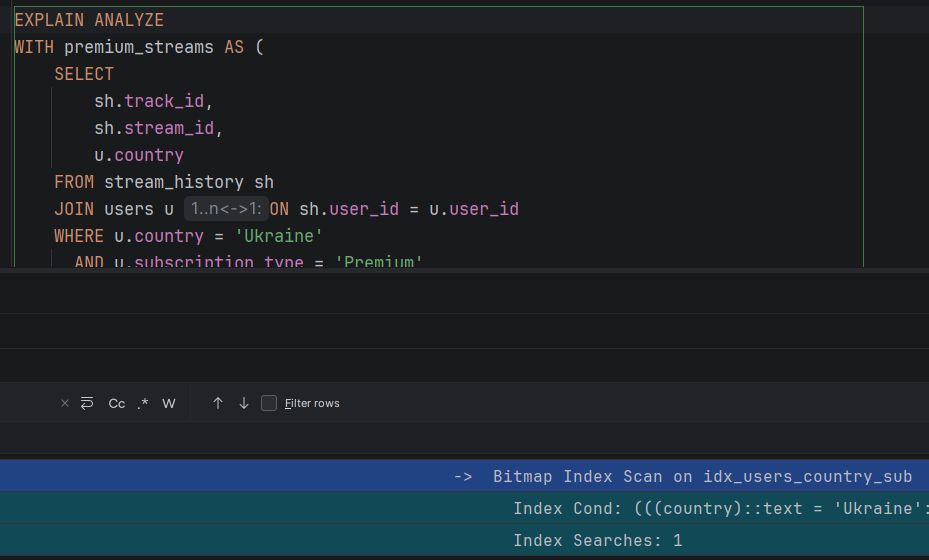

# Practical Assignment 4 — Semenchenko Ivan

## Опис бази даних

Ця база даних — спрощена модель музичного стрімінгового сервісу (на зразок Spotify або Apple Music), яка містить 8 таблиць і використовує зв'язки 1:1, 1:Many та Many:Many.

**ER-діаграма:**



| Таблиця | Опис |
|---|---|
| `users` | Профілі користувачів із зазначенням типу підписки (`Free`/`Premium`), міста та країни |
| `user_billing_info` | Платіжна інформація для Premium-користувачів (зв'язок **1:1** з `users`) |
| `artist` | Музичні виконавці та жанр, у якому вони грають |
| `album` | Альбоми виконавців (зв'язок **1:Many** від `artist`) |
| `track` | Окремі треки із зазначенням тривалості та номеру в альбомі (зв'язок **1:Many** від `album`) |
| `stream_history` | Історія прослуховувань: фіксує, який користувач, який трек і коли слухав |
| `playlist` | Користувацькі плейлисти (зв'язок **1:Many** від `users`) |
| `playlist_tracks` | Зв'язуюча таблиця для додавання треків у плейлисти (зв'язок **Many:Many**) |

## Оптимізація запиту

Для демонстрації оптимізації за допомогою індексів було згенеровано понад **1 000 000** записів в `stream_history` та 200 000 користувачів за допомогою Python скрипта `insert_data_big.py`.

### Аналітичний запит

Запит обчислює найпопулярніших виконавців серед Premium-користувачів для конкретної країни (напр. `'Ukraine'`) за певний проміжок часу та ранжує їх за допомогою віконної функції `RANK()`. Запит об'єднує 5 таблиць: `users`, `stream_history`, `track`, `album`, `artist`.

```sql
EXPLAIN ANALYZE
WITH premium_streams AS (
    SELECT
        sh.track_id,
        sh.stream_id,
        u.country
    FROM stream_history sh
    JOIN users u ON sh.user_id = u.user_id
    WHERE u.country = 'Ukraine'
      AND u.subscription_type = 'Premium'
      AND sh.stream_date >= '2023-12-01'
),
artist_stats AS (
    SELECT
        ar.artist_id,
        ar.artist_name,
        ar.genre,
        ps.country,
        COUNT(ps.stream_id) AS total_streams
    FROM premium_streams ps
    JOIN track t ON ps.track_id = t.track_id
    JOIN album al ON t.album_id = al.album_id
    JOIN artist ar ON al.artist_id = ar.artist_id
    GROUP BY ar.artist_id, ar.artist_name, ar.genre, ps.country
)
SELECT
    artist_name,
    genre,
    country,
    total_streams,
    RANK() OVER (PARTITION BY country ORDER BY total_streams DESC) AS rank_in_country
FROM artist_stats
WHERE total_streams > 10
ORDER BY country, rank_in_country;
```

### Індексація

Для прискорення запиту було створено 4 ключові індекси:

```sql
CREATE INDEX idx_users_country_sub ON users(country, subscription_type);

CREATE INDEX idx_stream_history_covering ON stream_history(user_id, stream_date) INCLUDE (track_id, stream_id);

CREATE INDEX idx_track_album ON track(track_id) INCLUDE (album_id);

CREATE INDEX idx_album_artist ON album(album_id) INCLUDE (artist_id);
```

- `idx_users_country_sub` — композитний індекс для фільтрації користувачів за країною та типом підписки
- `idx_stream_history_covering` — покриваючий індекс, що включає всі потрібні колонки `stream_history`
- `idx_track_album` та `idx_album_artist` — індекси для прискорення `JOIN` з `INCLUDE` для потрібних колонок


**План виконання ДО оптимізації:**



**План виконання ПІСЛЯ оптимізації:**




## Додатковий функціонал

### Ролі та привілеї

Створено три ролі для розмежування доступу:

```sql
CREATE ROLE music_admin WITH LOGIN PASSWORD 'Admin1234';
CREATE ROLE music_artist WITH LOGIN PASSWORD 'Artist1234';
CREATE ROLE music_listener WITH LOGIN PASSWORD 'Listener1234';
```

- `music_admin` — повний доступ (`ALL PRIVILEGES`) до всіх таблиць та послідовностей
- `music_artist` — може редагувати треки та альбоми (`INSERT`, `UPDATE`, `DELETE`), лише переглядати історію стрімів (`SELECT`)
- `music_listener` — може переглядати музику (`SELECT`), додавати прослуховування, редагувати власні плейлисти та змінювати свій статус підписки

### Представлення (View)

Представлення `top_20_tracks` автоматично підраховує кількість прослуховувань кожного треку та виводить 20 найпопулярніших разом з іменами їхніх альбомів:

```sql
CREATE OR REPLACE VIEW top_20_tracks AS (
    SELECT
        t.track_id,
        t.track_title,
        al.album_title,
        COUNT(sh.stream_id) AS streaming_count
    FROM streaming.track t
    JOIN streaming.album al ON t.album_id = al.album_id
    LEFT JOIN streaming.stream_history sh ON t.track_id = sh.track_id
    GROUP BY t.track_id, t.track_title, al.album_title
    ORDER BY COUNT(sh.stream_id) DESC
    LIMIT 20
);
```

### Процедура (Stored Procedure)

Процедура `upgrade_user_to_premium(p_user_id, p_card_number)` автоматизує процес купівлі підписки: змінює `subscription_type` користувача на `'Premium'` та одразу додає його картку до `user_billing_info`:

```sql
CREATE OR REPLACE PROCEDURE upgrade_user_to_premium(p_user_id INT, p_card_number VARCHAR)
LANGUAGE plpgsql
AS $$
BEGIN
    UPDATE users
    SET subscription_type = 'Premium'
    WHERE user_id = p_user_id;

    INSERT INTO streaming.user_billing_info (user_id, card_number)
    VALUES (p_user_id, p_card_number);
END;
$$;
```

### Тригер (Trigger)

Тригер `subscription_downgrade` реагує на зниження підписки. Якщо статус користувача змінюється з `'Premium'` на `'Free'` — автоматично видаляє його платіжну картку з `user_billing_info` в цілях безпеки:

```sql
CREATE OR REPLACE FUNCTION subscription_change()
RETURNS trigger
LANGUAGE plpgsql
AS $$
BEGIN
    IF OLD.subscription_type = 'Premium' AND NEW.subscription_type = 'Free' THEN
        DELETE FROM user_billing_info
        WHERE user_id = OLD.user_id;
    END IF;
    RETURN NULL;
END;
$$;

CREATE OR REPLACE TRIGGER subscription_downgrade
AFTER UPDATE
ON users
    FOR EACH ROW
    EXECUTE FUNCTION subscription_change();
```

## Додатково

- `create_tables_my.sql` — скрипт для створення таблиць
- `create_users.sql` — скрипт для створення ролей та налаштування привілеїв
- `create_view.sql` — скрипт для створення представлення `top_20_tracks`
- `create_procedure.sql` — скрипт для створення процедури `upgrade_user_to_premium`
- `create_trigger.sql` — скрипт для створення тригера `subscription_downgrade`
- `optimed_query.sql` — аналітичний запит з індексами та `EXPLAIN ANALYZE`
- `insert_data_big.py` — Python скрипт для генерації 1 000 000+ записів
